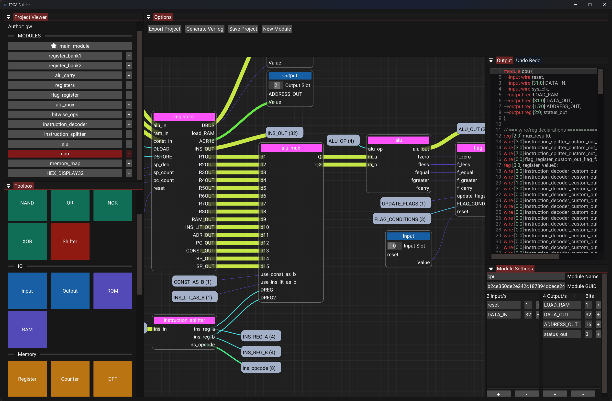

<a name="readme-top"></a>

<br />
<div align="center">
  <a href="https://github.com/gw12343/fpga-builder">
    
  </a>

  <p align="center">
    A visual, node-based circuit designer that compiles complex digital logic directly into working Verilog.
    <br />
    <a href="https://github.com/gw12343/fpga-builder"><strong>Explore the docs »</strong></a>
    <br />
    <br />
    <a href="https://fpgabuilder.gabrielwest.dev">View Live Web Demo</a>
    ·
    <a href="https://github.com/gw12343/fpga-builder/issues">Report Bug</a>
    ·
    <a href="https://github.com/gw12343/fpga-builder/issues">Request Feature</a>
  </p>
</div>

<div align="center">
  
  
  
  
  
</div>

---


## About The Project



Writing and visualizing hardware in HDLs like Verilog is notoriously verbose. **fpga-builder** streamlines the engineering workflow by bringing visual, node-based programming to FPGA design. Developers can wire logic gates, encapsulate custom reusable modules, and instantly compile graphs into synthesis-ready Verilog.

**Key Features:**
* **Intelligent Compilation:** Evaluates constant expressions to automatically strip dead code and unreachable branches.
* **Graph Safety:** Real-time AST evaluation actively detects and blocks unbroken combinational loops.
* **Visual Routing:** Utilize "tunnels" to connect distant nodes cleanly without wire clutter.
* **Custom Modules:** Encapsulate complex logic into single, reusable nodes for higher-level designs.
* **State Management:** Full undo/redo capabilities backed by a robust command pattern.
* **Cross-Platform:** Runs natively as a high-performance desktop app or entirely in-browser via WebAssembly.

<p align="right">(<a href="#readme-top">back to top</a>)</p>

### Built With

* [](https://isocpp.org/)
* [](https://www.libsdl.org/)
* [](https://emscripten.org/)
* [Dear ImGui](https://github.com/ocornut/imgui) & [ImGui-Node-Editor](https://github.com/thedmd/imgui-node-editor)

<p align="right">(<a href="#readme-top">back to top</a>)</p>

---

## Getting Started

To get a local copy up and running, follow these steps.

### Prerequisites

You will need a C++20 compatible compiler, CMake, and the SDL3 development libraries installed on your system.

If you intend to build the web viewer, you will also need the Emscripten SDK (`emsdk`).

### Installation (Native Build)

1. Clone the repository:
   ```sh
   git clone https://github.com/gw12343/fpga-builder.git
   cd fpga-builder
   ```

2. Generate build files via CMake:
    ```sh
    mkdir build && cd build
    cmake ..
    ```


3. Compile the application:
    ```sh
    make
    ```


### Web Build (Emscripten)

1. Ensure the Emscripten SDK is active in your current terminal:
    ```sh
    emsdk activate latest
    ```


2. Build using the emscripten toolchain:
    ```sh
    emcmake cmake ..
    emmake make
    ```


---

## Usage

**Building a Circuit:**

1. Open the **Project Viewer** on the left to view all available modules.
2. Click on primitive components from the **Toolbox** (Bitwise, IO, Memory, Misc, Wiring) to add them to the Canvas.
3. Wire components together. Use **Tunnels** to connect distant nodes cleanly without drawing long visual wires.
4. Click **Generate Verilog** in the top. The right-hand panel will immediately output the optimized `.v` code.

**Customizing Modules:**
Under the module settings tab on the right, you can adjust the module's GUID, rename I/O pins, and change specific bitwidths. Click the `+` icon next to an I/O pin to instantly drop it onto the active canvas.

**Extending the Backend:**
If you want to add custom code generation or extend the compiler, you can implement the AST visitor pattern. Use the current `Codegen.cpp` and `Codegen.h` files as a reference for how the visual graph is traversed, evaluated, and compiled into Verilog.

---

## Roadmap

* [x] ImGui Node Editor Integration
* [x] Basic Logic Gates & Wire Routing
* [x] Cycle Detection System
* [x] Custom Module Encapsulation
* [x] Constant Expression Evaluation / Dead-code Elimination
* [x] Emscripten Web Port
* [ ] Direct Verilog Simulation Integration
* [ ] Export to standard visual schematics (PDF/SVG)

See the [open issues](https://github.com/gw12343/fpga-builder/issues) for a full list of proposed features (and known issues).

---


## License

Distributed under the GPL-3.0 License. See `LICENSE` for more information.
